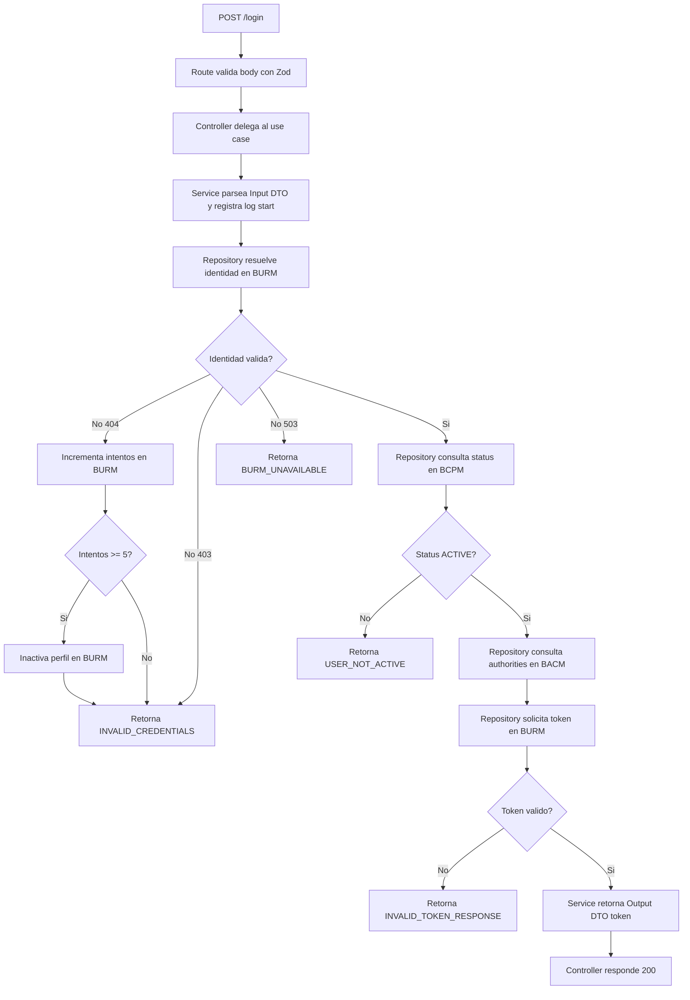

# WORKFLOW - bzpos-login_module-bbom

Este documento describe el flujo funcional actual del modulo de login BBOM.

## Flujo funcional

## Contratos externos involucrados

- BURM Identity: validacion de credenciales e identidad.
- BCPM Status: estado del perfil.
- BACM Authorities: permisos por rol.
- BURM Token: emision de token de autenticacion.

## Reglas de sincronizacion documental

Cuando cambie el flujo funcional del login, este archivo y README deben actualizarse juntos.
